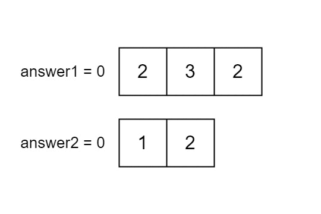

# 2956.找到两个数组中的公共元素[简单]

给你两个下标从 0 开始的整数数组 `nums1` 和 `nums2` ，它们分别含有 `n` 和 `m` 个元素。请你计算以下两个数值：

* `answer1`：使得 `nums1[i]` 在 `nums2` 中出现的下标 `i` 的数量。
* `answer2`：使得 `nums2[i]` 在 `nums1` 中出现的下标 `i` 的数量。

返回 `[answer1, answer2]`。

**示例 1：**

输入：`nums1 = [2,3,2], nums2 = [1,2]`

输出：`[2,1]`

解释：



**示例 2：**

输入：`nums1 = [4,3,2,3,1], nums2 = [2,2,5,2,3,6]`

输出：`[3,4]`

解释：

`nums1` 中下标在 1，2，3 的元素在 `nums2` 中也存在。所以 `answer1` 为 3。

`nums2` 中下标在 0，1，3，4 的元素在 `nums1` 中也存在。所以 `answer2` 为 4。

**示例 3：**

输入：`nums1 = [3,4,2,3], nums2 = [1,5]`

输出：`[0,0]`

解释：

`nums1` 和 `nums2` 中没有相同的数字，所以答案是 `[0,0]`。

提示：

* `n == nums1.length`
* `m == nums2.length`
* `1 <= n, m <= 100`
* `1 <= nums1[i], nums2[i] <= 100`

## 答案

### Java

```java
// O(mn)
class Solution {
    public int[] findIntersectionValues(int[] nums1, int[] nums2) {
        List<Integer> list1 = Arrays.stream(nums1).boxed().collect(Collectors.toList());
        List<Integer> list2 = Arrays.stream(nums2).boxed().collect(Collectors.toList());

        int count1=0,count2=0;
        for(Integer num:list1){
            if(list2.contains(num)){
                count1++;
            }
        }
        for(Integer num:list2){
            if(list1.contains(num)){
                count2++;
            }
        }
        return new int[]{count1,count2};
    }
}
```

上面的代码用到了 Java 里的集合 `List`,包括其方法`List.contains()`,内存消耗和计算都不是最优的，还能继续优化

```java
// 使用 hash集合，这样时间复杂度能降低到 O(m+n)
class Solution {
    // 9ms 11.68%, 44.38MB,74.31%
    public int[] findIntersectionValues3(int[] nums1, int[] nums2) {
        HashMap<Integer,Integer> map1 = new HashMap();
        HashMap<Integer,Integer> map2 = new HashMap();

        for(int num:nums1)
            map1.put(num,map1.containsKey(num)? map1.get(num) + 1: 1);
        for(int num:nums2)
            map2.put(num,map2.containsKey(num)? map2.get(num) + 1: 1);

        int count1=0,count2=0;

        for(Map.Entry<Integer,Integer> entry: map1.entrySet()) {
            Integer key = entry.getKey();
            if(map2.containsKey(key))
                count1 += map2.get(key);
        }

        for(Map.Entry<Integer,Integer> entry: map2.entrySet()) {
            Integer key = entry.getKey();
            if(map1.containsKey(key))
                count2 += map1.get(key);
        }

        return new int[]{count2,count1};
    }
}
```

```java
// 这个代码相比上面，空间消耗优化了，使用一个set集合即可，set.contains时间复杂度也降低了
class Solution {
    public int[] findIntersectionValues(int[] nums1, int[] nums2) {
        HashSet set = new HashSet<Integer>();
        int[] res=new int[2];

        for(int num:nums2) {
            set.add(num);
        }

        for(int num:nums1) {
            if(set.contains(num)){
                res[0]++;
            }
        }

        set.clear();

        for(int num:nums1) {
            set.add(num);
        }

        for(int num:nums2) {
            if(set.contains(num)){
                res[1]++;
            }
        }

        return res;
    }
}
```

如果能够不需要Hash，使用数组来实现Hash的效果，只是使用一个额外数组A，这个数组A的数组下标是nums1,而取值表示的是下标这个值出现在nums2中的值(先只是统计下标在nums1中的重复值计数)

```java
class Solution {
    public int[] findIntersectionValues(int[] nums1, int[] nums2) {
        int[] nums = new int[101];
        for (int i : nums1) {
            nums[i]++;
        }
        int n1 = 0, n2 = 0;
        for (int i : nums2) {
            if (nums[i] != 0) {
                n2++;
                n1 += (nums[i] == -1 ? 0 : nums[i]);
                nums[i] = -1;//这是为了防止nums2中的值被重复统计
            }
        }
        return new int[]{n1, n2};
    }
}
```

### Python


### C++

### C

C语言太麻烦了，如果有需要用到一些其他的数据结构，还需要自己去实现。其他语言就不需要自己实现，有基本的库可以提供。除非题目本身用不到一些数据结构，但那是不太可能得